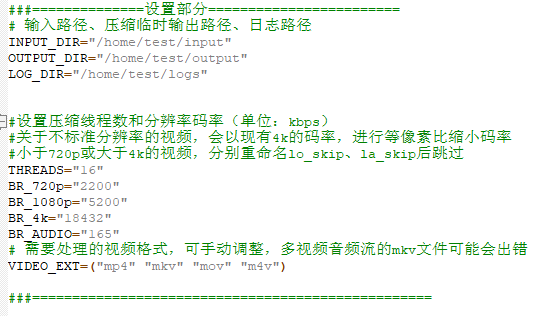
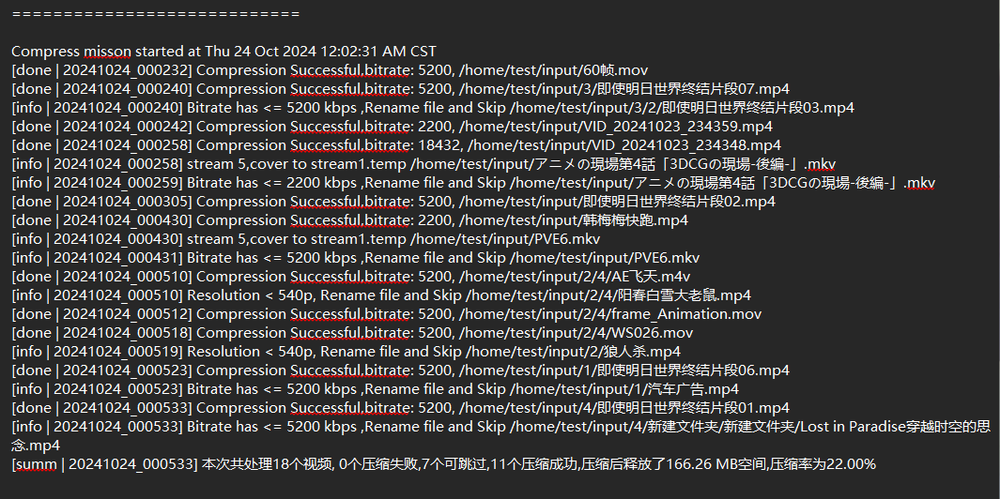

## video_compressv2.sh——NAS全自动压缩视频
功能：根据设定的码率，自动筛选需要压缩的视频，批量压缩指定文件夹内所有视频文件，并自动替换源文件。
注意：该脚本涉及删除源文件操作，使用该脚本前，请保障资料备份，资料丢失本人概不负责

### 脚本逻辑
该脚本会搜索指定文件夹内（子文件夹）的所有视频，并进行码率比较，高于设定码率的视频全部以指定码率压缩，首次压缩完成不会立即替换源文件，而是在下一次启动脚本才会进行替换，替换后意味着源文件会被删除，请再三备份好自己的资料再进行操作，否则压缩后高码率原视频不再存在！


替换路径保存在log文件夹的video_done_log.txt文件中，请不用手动清理该文件，否则无法进行文件替换。

### 使用：
1.请自行安装FFmpeg、FFprobe、bc,并设置至系统变量中(一般无需额外设置)
```
#debian
apt install ffmpeg ffprobe bc
```
2.设置好图中的内容，建议首次执行先使用一个10s左右的大码率视频文件做测试，输出无误再设置成相册目录


3.把该脚本加入crontab定时任务中

### 结果日志范例：

